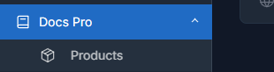

# Docs Pro

Docs Pro is a Botble plugin that ships a standalone documentation portal without depending on a public theme. It keeps product documentation isolated from the rest of the site and lets each product own its own doc tree, default page, and public URL space.

## What it solves

With Docs Pro you can create multiple Product Docs portals and, inside each one, build a documentation tree with `Doc`, `Title`, and `Separator` nodes. Content is written in Markdown and published through a Fumadocs-inspired portal with a sidebar, search, product switcher, and `On this page` navigation.

## Recommended workflow

1. Create a Product Docs entry in the admin panel.
2. Mark one product as default if it should open at `/docs`.
3. Open the product editor.
4. Build the tree with `Doc`, `Title`, and `Separator`.
5. Write the page content in Markdown.
6. Save the full snapshot.
7. Review the public portal and adjust navigation, search, and headings.

## Main routes

- `/docs` opens the default product.
- `/docs/{product-slug}` opens the product root and shows its default doc.
- `/docs/{product-slug}/{doc-path}` opens a specific page inside that product.

## Import or build manually

Docs Pro supports two authoring flows:

- Build everything in the visual editor.
- Import a ZIP made of folders, Markdown files, and assets.

Folders become `Title` nodes, Markdown files become `Doc` nodes, and names such as `_` or `_.md` become `Separator` nodes.

## Public portal

## Admin quick actions

