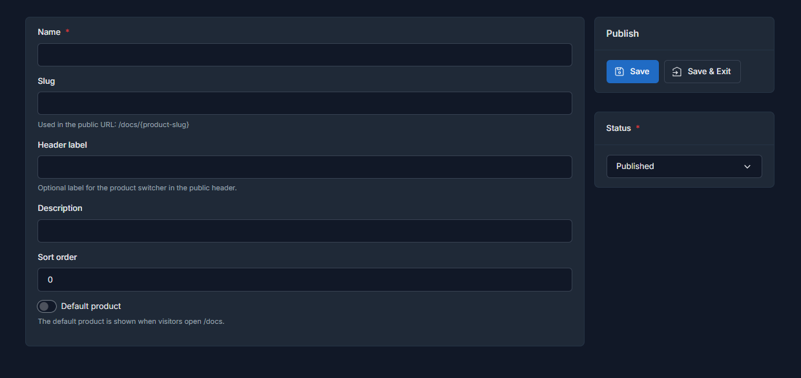

# Product docs

Each Product Docs entry represents an independent documentation portal inside Docs Pro. Think of it as the top-level container for a product, module, or business line.

## Main fields

When you create or edit a product you usually work with:

- `Name`: internal and public-facing product name.
- `Slug`: public segment used in `/docs/{product-slug}`.
- `Header label`: compact label used by the public product switcher.
- `Description`: short description shown only inside the opened product dropdown.
- `Default product`: defines which product opens at `/docs`.
- `Status`: controls whether the product is publicly available.

`Slug` and `Header label` can auto-fill from `Name` when creating a new product, then you can keep or override them manually.

## Quick actions

Each product exposes fast actions so the full workflow stays one click away:

- open the docs editor
- open the ZIP import screen
- export the current tree as ZIP
- open the public portal

## Default product

If there is more than one product, one of them should be the default. That product is resolved when a visitor opens `/docs`. If you do not set one manually, Docs Pro still tries to keep a default product available.

## Good practices

- Keep the `slug` short and stable.
- Use `Header label` only when the public switcher needs a shorter name.
- Write a short description if the selector should provide extra context.
- Keep one clear portal per product. Avoid mixing unrelated documentation trees in the same product.

## Products table

## Product form

