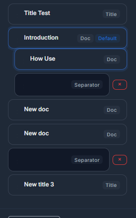

# Node tree

The structure editor is the operational center of Docs Pro. From there you can sort, nest, and edit the full product tree without hopping between separate screens.

## Node types

The tree supports three node types:

- `Doc`: creates a public page.
- `Title`: groups child nodes under a navigation heading.
- `Separator`: inserts a visual divider line.

## How they behave

`Doc` nodes render public content. `Title` nodes only organize the sidebar and do not render a standalone page. `Separator` nodes only add visual separation inside the navigation.

## Drag and nest

You can drag nodes to reorder them or move them under another `Doc` or `Title`. That makes it possible to build trees such as:

```text
Introduction
  Install
  First steps
Guides
  Daily usage
  Integrations
```

Separators can still be dragged, but they are not selectable for content editing.

## Public menu expansion

On the public portal, branches do not have to stay open all at once. The active branch opens automatically when the current page belongs to it, and opening another branch can close the rest of the tree to keep the sidebar compact.

## Tree overview


## Drag and drop


