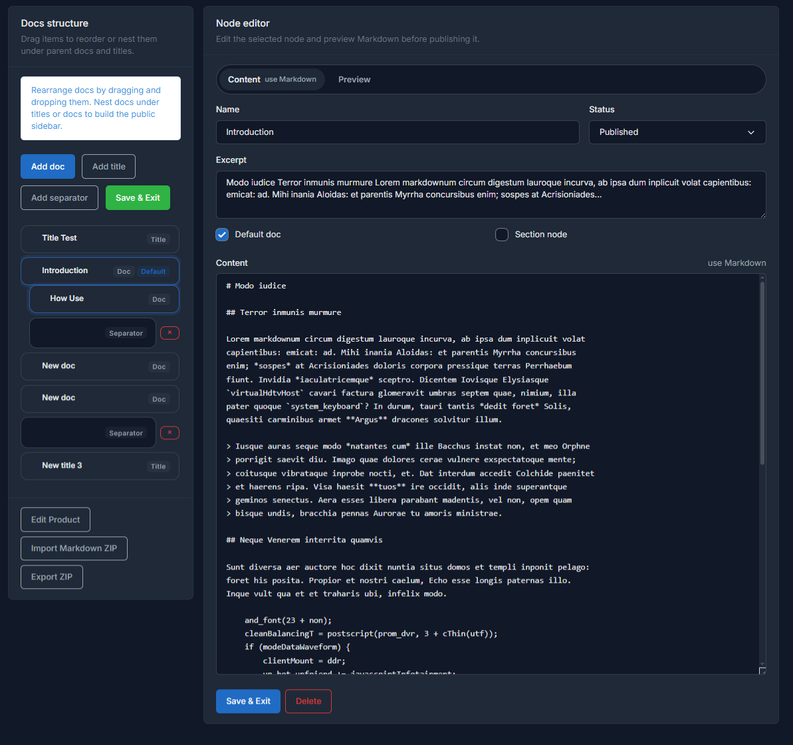
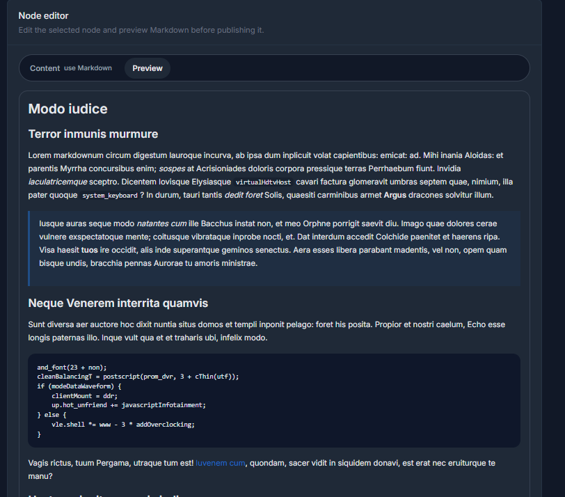

# Content editor

When you select an editable node, the right panel loads the matching form so you can work without leaving the editor.

## Doc

A `Doc` node opens a content-focused form. In most cases you work with:

- `Name`
- `Excerpt`
- `Default doc`
- `Status`
- `Content`
- `Preview`

The `slug` is generated automatically from `Name`. The page body is written in Markdown and reviewed from the `Preview` tab.

## Title

A `Title` node only needs a visible heading for the navigation block. It does not render public content.

## Separator

A `Separator` node does not open a content form. It is a structural item used only to insert a divider line inside the tree.

## Markdown and preview

The `Content` tab is used for authoring Markdown. The `Preview` tab renders the result before saving, which is useful while adjusting headings, lists, code blocks, tables, or embedded images.

## Legacy content

If a node still comes from an older HTML-based version, saving Markdown replaces the legacy rendered output with the new Markdown result.

## Content tab

## Preview tab

