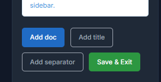

# Saving changes

The modern Docs Pro editor works in local browser state first. That means several actions happen without sending an immediate request to the server.

## Reactive changes

These actions can happen in memory before the final save:

- add `Doc`
- add `Title`
- add `Separator`
- move nodes inside the tree
- edit the currently selected form

This keeps the editor responsive even when the documentation tree is large.

## Full snapshot save

The `Save` action persists everything at once:

- the tree structure
- node order
- parent and child relations
- the current node content
- the default doc state
- published or draft status

That avoids creating a separate request for every small change.

## Unsaved changes warning

If you switch nodes while local changes are still pending, the editor can warn you before discarding that state. This matters most when you are restructuring the tree and editing content at the same time.

## Recommended cadence

1. shape the base structure
2. complete the key docs
3. save the full snapshot
4. validate the public portal
5. return for smaller refinements

## Save state

