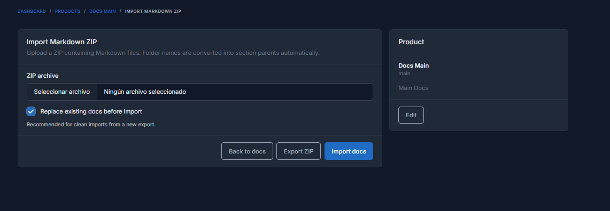
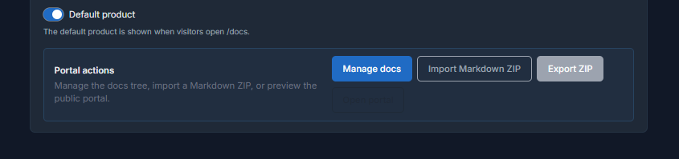

# Import and export

Docs Pro can move documentation between projects or environments by using ZIP archives.

## Import

The import screen accepts a ZIP file containing folders, `.md` files, separators, and assets such as images. The importer rebuilds the product tree from the physical structure of the archive.

If you enable `Replace existing docs before import`, the current tree is removed before loading the new one. This is useful for clean replacements or for restoring a recent export.

## Export

Exports generate a ZIP with:

- folders for `Title`
- `.md` files for `Doc`
- `_.md` files for `Separator`
- copied assets referenced by Markdown
- a hidden `.docs-pro.json` manifest

That hidden manifest preserves extra details such as the default doc, document status, and structure cases that a plain ZIP cannot express by itself.

## Round-trip workflow

The recommended round-trip flow is:

1. export from the current product
2. review or version the ZIP
3. reimport it into another environment or back into the same product

When the ZIP was exported by Docs Pro, reimporting is more accurate because the manifest and the asset layout are already aligned with the plugin rules.

## Manual archives

You can also build a ZIP manually without `.docs-pro.json`. In that case Docs Pro uses folder names, `.md` files, `_` separators, and leading numbers for ordering.

## Import screen

## Export action

