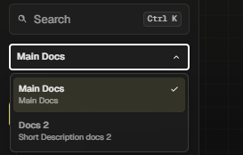

# Routes and defaults

The public Docs Pro portal lives under `/docs` and does not depend on the site frontend theme.

## Default product

When a visitor opens `/docs`, Docs Pro resolves the Product Docs entry marked as default and uses it as the main portal entry point.

## Default doc

Inside each product, there is also a `Default doc`. That document opens when the visitor enters the product root:

```text
/docs/{product-slug}
```

If no explicit default doc exists, Docs Pro still tries to keep one available so the portal never loses its entry page.

## Internal URLs

Each published doc resolves through its `slug_path`, for example:

```text
/docs/main/getting-started
/docs/main/guides/install
```

That `slug_path` depends on the current tree hierarchy and updates when a node changes parent or slug.

## Product switcher

The product selector is always visible in the sidebar. When more than one product exists, it works as the fast portal switcher. When only one product exists, it stays visible for a consistent layout.

## Product selector



## Default portal entry


