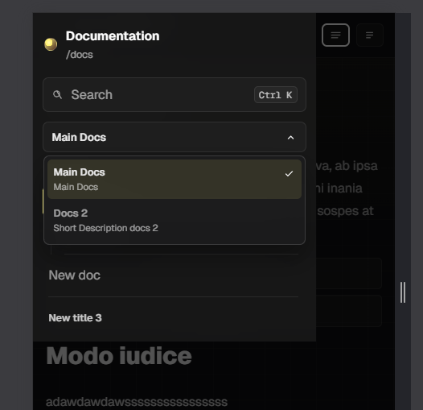

# Sidebar and search

The sidebar is the main navigation piece of the portal. Its job is to let readers move through a large doc tree without depending on theme menus.

## Search

The `Search` field filters the visible nodes in the current tree. While searching, branches that contain matches can open automatically so relevant results stay visible. If nothing matches, an empty state is shown.

## Titles, docs, and separators

Inside the sidebar:

- `Title` groups related pages
- `Doc` points to real pages
- `Separator` inserts a visual break between groups

This makes it possible to build compact, technical navigation trees.

## Branch expansion

The portal can open only the active branch by default. If the reader expands another group, the rest of the open branches can close automatically so the sidebar does not grow too much. The product selector is intentionally excluded from that exclusive close behavior.

## Mobile

On smaller screens, the sidebar becomes a slide-out panel. The reader can open it, close it, and navigate without losing the main article context.

## Search in the sidebar

## Mobile sidebar

