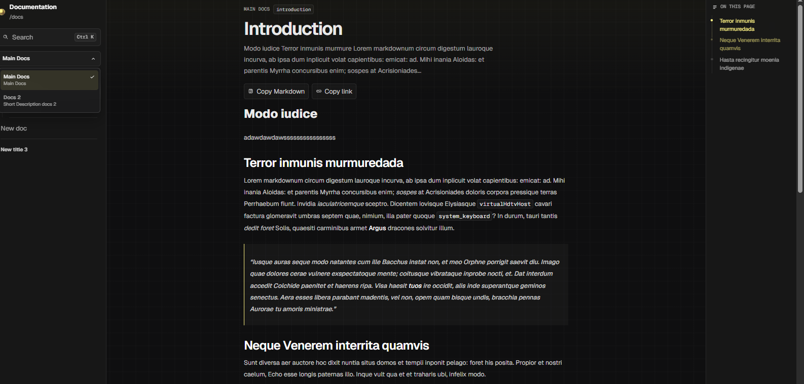
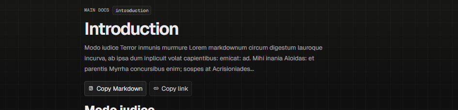

# On this page

The `On this page` block is generated from the rendered article headings. It helps the reader stay oriented inside longer documents.

## Indexed headings

The right-side index is built from `h2`, `h3`, and `h4` headings in the rendered Markdown. If the content does not include indexable headings, the block shows an empty state.

## Visible state

The current behavior does not highlight only one isolated heading. It can highlight several headings that are visible at the same time and gradually reduce their intensity as the related sections leave the viewport. That makes the indicator feel more faithful while scrolling.

## Connectors and reading flow

Each visible item can display a dot and a connected line with the other visible headings, creating a guided reading path. As a section moves out of view, the visual intensity fades.

## Article actions

The article header can also expose useful actions such as:

- `Copy Markdown`
- `Copy link`

At the bottom of the page the portal can also render `Previous` and `Next` navigation.

## Good practices

- use `h2` for major sections
- use `h3` for subsections
- avoid skipping heading levels
- keep labels short and descriptive

## On this page

## Article actions

