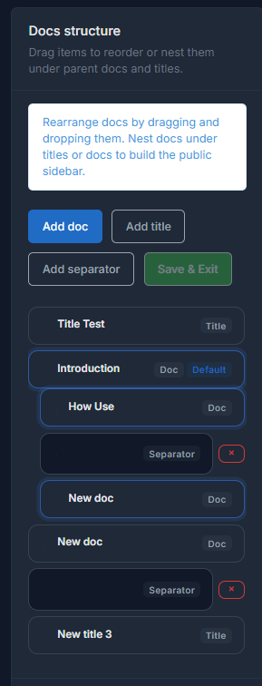

# Node types

Docs Pro uses three node types. Understanding the difference between them keeps the navigation tree clean and predictable.

## Doc

`Doc` is the only type that renders a real public page. It has Markdown content, preview, status, and can be marked as the default page inside the product.

Use it for:

- guides
- tutorials
- technical references
- changelogs
- technical FAQ

## Title

`Title` groups several nodes under a shared heading. It has no public content of its own and only affects sidebar structure and tree order.

Use it for:

- grouping by category
- splitting documentation by technical area
- dividing a large section into smaller clusters

## Separator

`Separator` adds a visual line to the sidebar. It does not open a content form and does not create a public page.

Use it for:

- separating navigation blocks
- breaking very long lists
- marking a transition between portal areas

## Section badge

A `Doc` can also be marked as `Section` when you want it to carry an additional visual badge inside the tree. It is still a normal doc, just with extra navigation weight.

## Default doc

Only a `Doc` can be the default page for a product. `Title` and `Separator` cannot take that role.

## Published or draft

Status matters most for `Doc`. Draft content should not be treated the same way as published content while assembling the final portal.

## Mixed node tree

