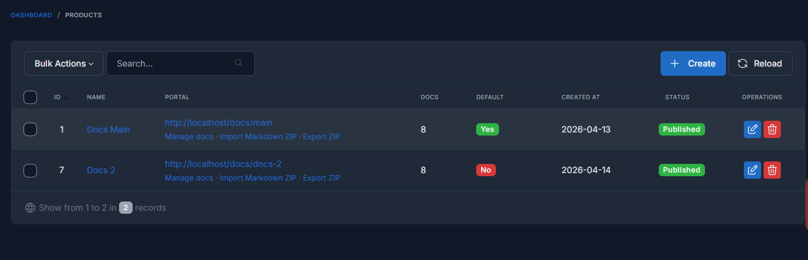
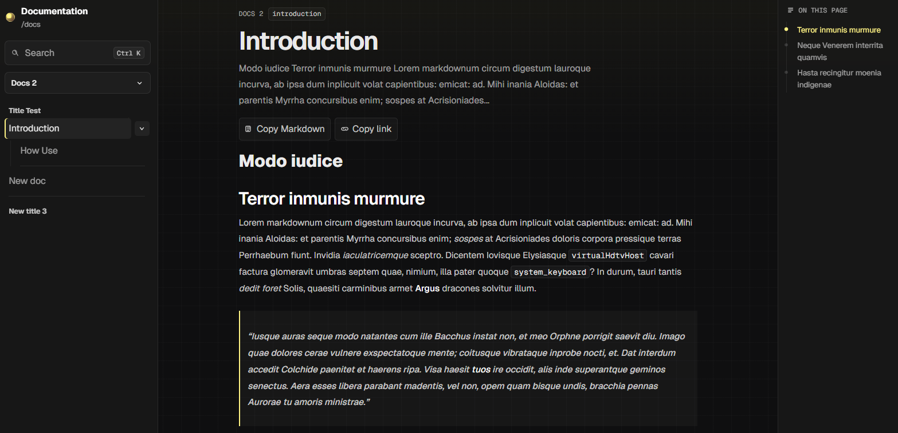

# Images and assets

This documentation package is now meant to be imported with real images, not only placeholders.

## Current behavior

The importer currently handles:

- folder structure
- `_` separators
- `.md` files
- leading numbers for ordering
- non-Markdown assets such as images

When a Markdown file contains a relative image such as ``, Docs Pro stores the asset, resolves it on the public portal, and includes it again on export.

## Recommended pattern

Keep the documentation package self-contained:

1. write content in Markdown
2. store screenshots inside `docs/img`
3. reference them with relative paths
4. import the ZIP into Docs Pro

Example:

```md

```

## Asset round-trip

Exports copy the referenced files back into the ZIP so the package can be reimported without breaking the image references.

## Asset example


